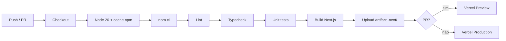

# CI/CD

## Visão geral

Pipeline mínimo, rodando em **GitHub Actions** (Ubuntu) a cada push em `main` e em cada PR aberta para `main`.

## Workflows

### `.github/workflows/ci.yml`

| Etapa     | Comando             | Falha se                            |
| --------- | ------------------- | ----------------------------------- |
| Install   | `npm ci`            | `package-lock.json` inconsistente   |
| Lint      | `npm run lint`      | erros ESLint (warnings não bloqueia) |
| Typecheck | `npm run typecheck` | erro TS                              |
| Test      | `npm test`          | qualquer teste vermelho             |
| Build     | `npm run build`     | erro Next.js                        |

O CI **não recebe nenhuma credencial**. Como [`src/lib/env.ts`](../../src/lib/env.ts) marca todas as variáveis externas como `.optional()` (ou com default no Zod), build e testes passam sem nenhum segredo. As envs reais vivem apenas no painel da Vercel — `Settings → Environment Variables` — separadas por escopo (Production/Preview/Development).

Se uma futura feature precisar de credencial obrigatória no CI (ex.: e2e contra DB de teste), o caminho é **GitHub → Settings → Secrets and variables → Actions**, e referenciar via `${{ secrets.NOME }}` no workflow.

### `.github/workflows/pr-checks.yml`

Valida o título da PR no formato **Conventional Commits** (`feat:`, `fix:`, `docs:`...). Sem isso, mensagens de release ficam ilegíveis.

## Branch protection (sugerido)

No GitHub → Settings → Branches → `main`:

- ✅ Require a pull request before merging
- ✅ Require status checks to pass:
  - `Lint · Typecheck · Test · Build`
  - `Conventional Commit · PR Title`
- ✅ Require branches to be up to date
- ✅ Require linear history
- ✅ Do not allow bypassing the above

## Performance / cache

- Cache `npm` via `actions/setup-node` (chave por `package-lock.json`).
- Cache `.next/cache` desabilitado por enquanto (build limpo). Habilitar quando build > 3 min.
- `concurrency.cancel-in-progress: true` — pushs novos cancelam runs em andamento na mesma ref.

## Próximos passos (Wave 2+)

- [ ] Playwright e2e em job paralelo (gated por label `e2e`)
- [ ] Drizzle migrations check (`drizzle-kit check` contra `main`)
- [ ] Lighthouse-CI para `/`, `/login`, `/cadastro`
- [ ] Bundle analyzer (alert se First Load JS > 150kb numa rota)
- [ ] Dependabot/renovate
