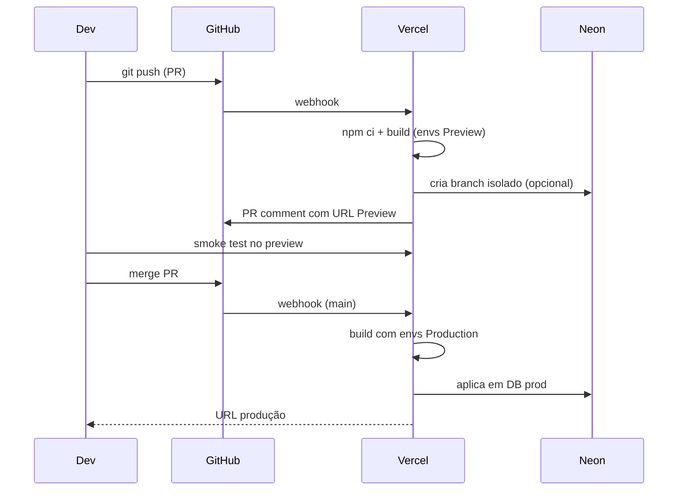

# Deploy na Vercel

Esta aplicação é otimizada para Vercel (Next.js 15, App Router, RSC, Server Actions).

## Setup inicial (uma única vez)

### 1. Conectar o repositório

1. Acesse [vercel.com/new](https://vercel.com/new) com sua conta.
2. **Import Git Repository** → selecione `TiagoAlmeidaS/central_acolhimento_app`.
3. **Framework Preset**: Next.js (autodetectado).
4. **Root Directory**: `./` (padrão).
5. **Build Command**, **Output Directory**, **Install Command**: deixe os defaults — `vercel.json` na raiz já cobre o necessário.
6. Clique em **Deploy** sem envs ainda — o build pode falhar por causa do banco; tudo bem, vamos configurar a seguir.

### 2. Configurar Environment Variables

Em **Project → Settings → Environment Variables**, adicione cada variável separando os 3 escopos da Vercel:

- **Production**: usada em `main` (vercel.app/prod)
- **Preview**: usada em cada PR (vercel.app/<branch>-<sha>)
- **Development**: usada quando se roda `vercel dev` localmente

Mapa completo em [`environments.md`](./environments.md). Mínimos para o app subir:

| Variável                  | Production           | Preview              | Como obter                                                          |
| ------------------------- | -------------------- | -------------------- | ------------------------------------------------------------------- |
| `NEXT_PUBLIC_APP_URL`     | URL final            | `$VERCEL_URL`        | a URL pública (ex.: `https://acolhe.app`)                           |
| `DATABASE_URL`            | Neon prod            | Neon branch          | ver [`integrations/neon.md`](./integrations/neon.md)                |
| `AUTH_SECRET`             | random 32+ chars     | random 32+ chars     | `openssl rand -base64 32`                                           |
| `AUTH_TRUST_HOST`         | `true`               | `true`               | constante                                                           |
| `WHATSAPP_DEV_MODE`       | `false`              | `true` (provisório)  | depois de ativar credenciais Meta                                   |
| `WHATSAPP_TOKEN`          | token Meta           | (vazio em preview)   | ver [`integrations/whatsapp-cloud-api.md`](./integrations/whatsapp-cloud-api.md) |
| `WHATSAPP_PHONE_NUMBER_ID`| do número Meta       | (vazio em preview)   | mesmo guia                                                          |
| `STRIPE_SECRET_KEY`       | `sk_live_…`          | `sk_test_…`          | ver [`integrations/stripe.md`](./integrations/stripe.md)            |
| `STRIPE_WEBHOOK_SECRET`   | `whsec_live_…`       | `whsec_test_…`       | mesmo guia                                                          |
| `STRIPE_PRICE_ESSENCIAL`  | `price_…`            | `price_…` (test)     | mesmo guia                                                          |
| `STRIPE_PRICE_PRO`        | `price_…`            | `price_…` (test)     | mesmo guia                                                          |
| `ANTHROPIC_API_KEY`       | `sk-ant-live-…`      | `sk-ant-test-…`      | ver [`integrations/anthropic.md`](./integrations/anthropic.md)      |
| `UPSTASH_REDIS_REST_URL`  | DB prod              | DB preview           | ver [`integrations/upstash.md`](./integrations/upstash.md)          |
| `UPSTASH_REDIS_REST_TOKEN`| token prod           | token preview        | mesmo guia                                                          |

> **Dica:** marque cada env conforme `Sensitive` na UI da Vercel. Isso oculta o valor após salvar.

### 3. Region

`vercel.json` fixa `gru1` (São Paulo). Mude se quiser:

```jsonc
{
  "regions": ["gru1"]
}
```

### 4. Domínio customizado (opcional)

Project → Settings → Domains → **Add**. A Vercel cuida do certificado.

## Fluxo de deploy



## Comandos úteis (Vercel CLI)

```bash
npm i -g vercel
vercel login
vercel link          # vincula repo local ao projeto
vercel env pull      # baixa envs (.env.local) para dev
vercel dev           # roda Next + serverless funcs localmente
vercel --prod        # deploy manual em produção (raramente necessário)
```

## Troubleshooting

- **Build falha por env ausente**: cheque `src/lib/env.ts`. Toda variável obrigatória explode no `EnvSchema.parse(...)`.
- **OTP não chega no preview**: deixe `WHATSAPP_DEV_MODE=true` em Preview — o código é logado em `vercel logs`.
- **Webhook Stripe não bate**: precisa de URL pública (Stripe não bate em preview por padrão). Use `stripe listen --forward-to ...vercel.app/api/webhooks/stripe` para mapear, ou use ambientes test.
- **Database connection limit (Neon)**: Vercel serverless cria muitas conexões. Use `?pgbouncer=true&connection_limit=1` na DATABASE_URL.

## Rollback

Vercel mantém todos os deploys. Em **Project → Deployments**, clique no deploy anterior → **Promote to Production**. Reversão em segundos.
